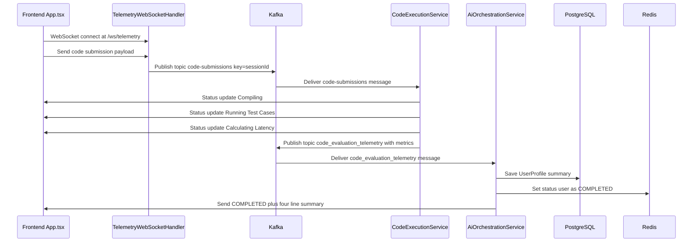
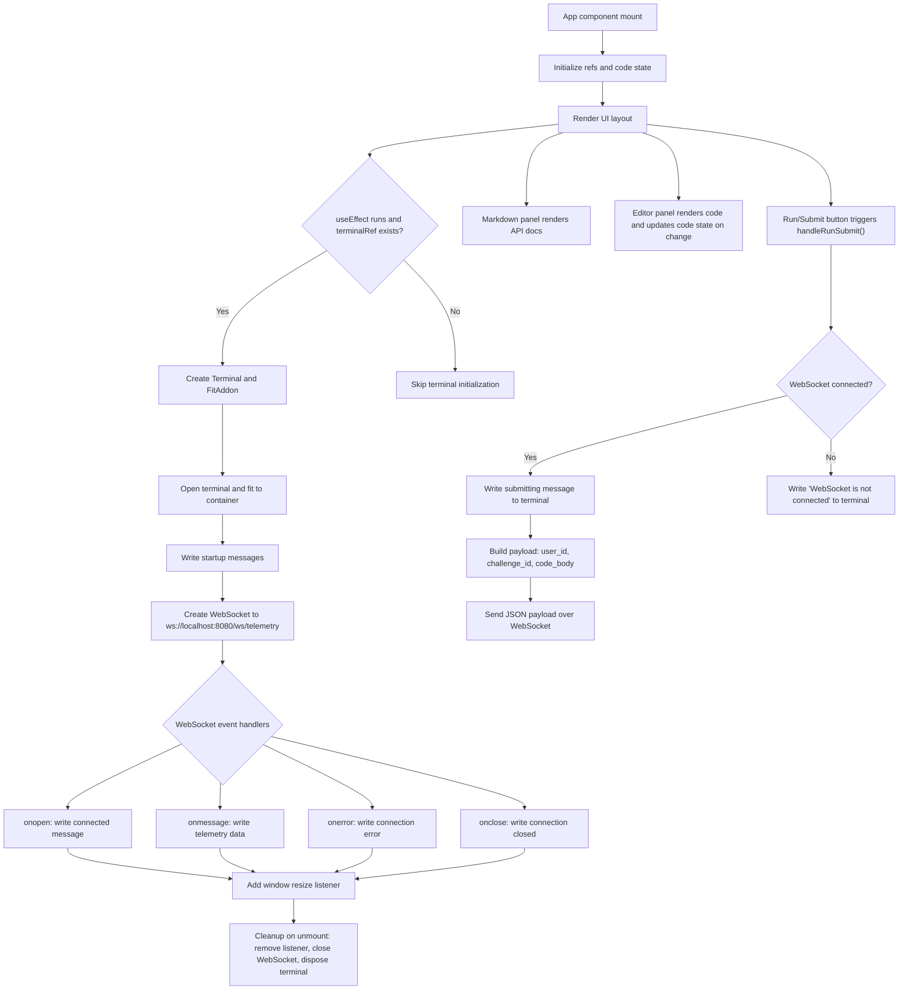

# Bridge.AI Developer Agent Instructions

Welcome to the Bridge.AI evaluation platform repository. This document outlines the overall architecture, context, and deployment targets to help AI agents (like yourself) navigate and modify this monorepo effectively.

## 1. Monorepo Architecture

This project is structured as a full-stack monorepo:

### Backend (`/backend`)
- **Technology Stack:** Java 21, Spring Boot 3.3.x, Maven
- **Core Dependencies:**
  - Spring Web, Spring Data JPA, Spring Data Redis, Spring Websocket
  - Spring Kafka (for event-driven communication)
  - PostgreSQL (persistent storage via JDBC)
  - Redis (high-speed active session caching)
  - Azure OpenAI SDK (\`com.azure:azure-ai-openai\`) for endpoint routing
- **Event Flow:** The service acts as both a producer and consumer for the \`code_evaluation_telemetry\` Kafka topic.
- **Run Locally:** Ensure PostgreSQL, Redis, and Kafka are running, then execute \`./mvnw spring-boot:run\` from the \`/backend\` directory.

### Frontend (`/frontend`)
- **Technology Stack:** React 19, TypeScript, Vite
- **UI Architecture:** Dark-themed, side-by-side split-pane layout.
  - **Left Pane:** Displays structured API documentation via \`react-markdown\`.
  - **Right Pane:** Incorporates a live code editor (\`@monaco-editor/react\`) and a telemetry terminal (\`@xterm/xterm\`, \`@xterm/addon-fit\`). The terminal consumes WebSocket telemetry logs emitted by the backend.
- **Run Locally:** Execute \`npm install\` followed by \`npm run dev\` from the \`/frontend\` directory.

## 2. Kafka Event Flows
The primary topic is \`code_evaluation_telemetry\`.
- **Producer:** The backend service publishes code evaluation statuses, standard out logs, and agent routing telemetry to this topic.
- **Consumer:** The backend simultaneously listens to this topic and pipes the consumed telemetry to connected frontend clients via WebSockets, creating a real-time log terminal effect in the browser.

## 3. CI/CD and Deployment
The repository includes a GitHub Actions workflow located at \`.github/workflows/main.yml\`.
- **Backend Deployment:** Built with Maven and deployed to **Azure Container Apps**.
- **Frontend Deployment:** Built with Vite (\`npm run build\`) and deployed to **Azure Static Web Apps**.

When making changes, ensure that both backend tests (via \`./mvnw test\`) and frontend builds succeed, and adhere to the architectural styles defined above.

## 4. End-to-End Sequence Diagram

The following sequence diagram details the full path from code submission to AI evaluation and UI update.

## 5. Frontend High-Level Design (HLD)

The following flowchart details the initialization and behavior of the main `App.tsx` component.

